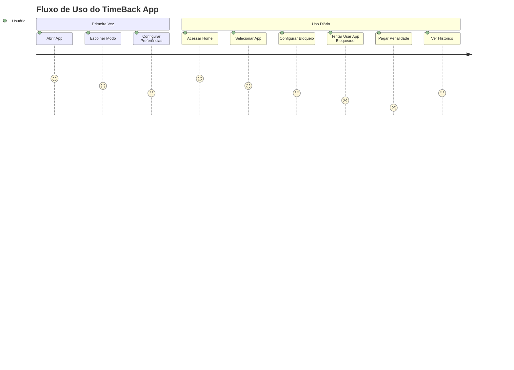
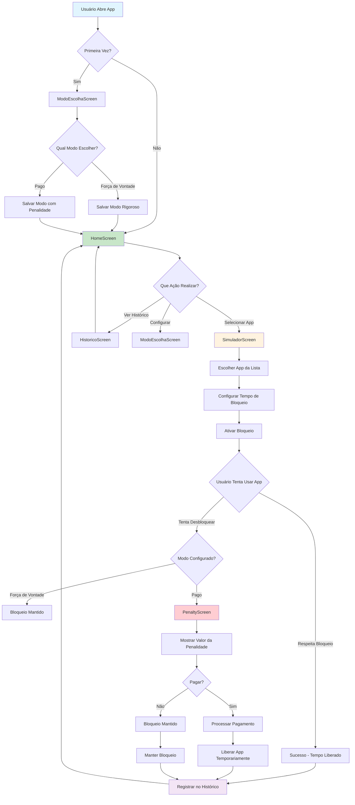
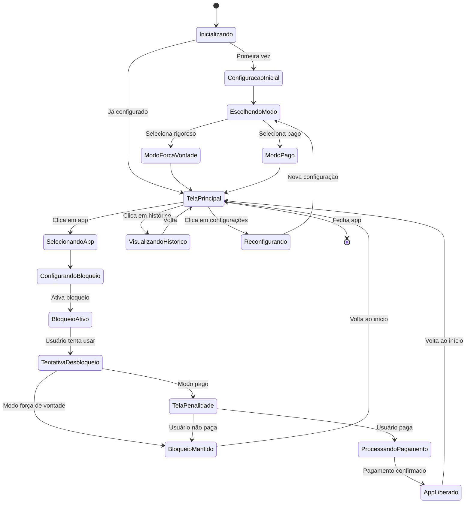
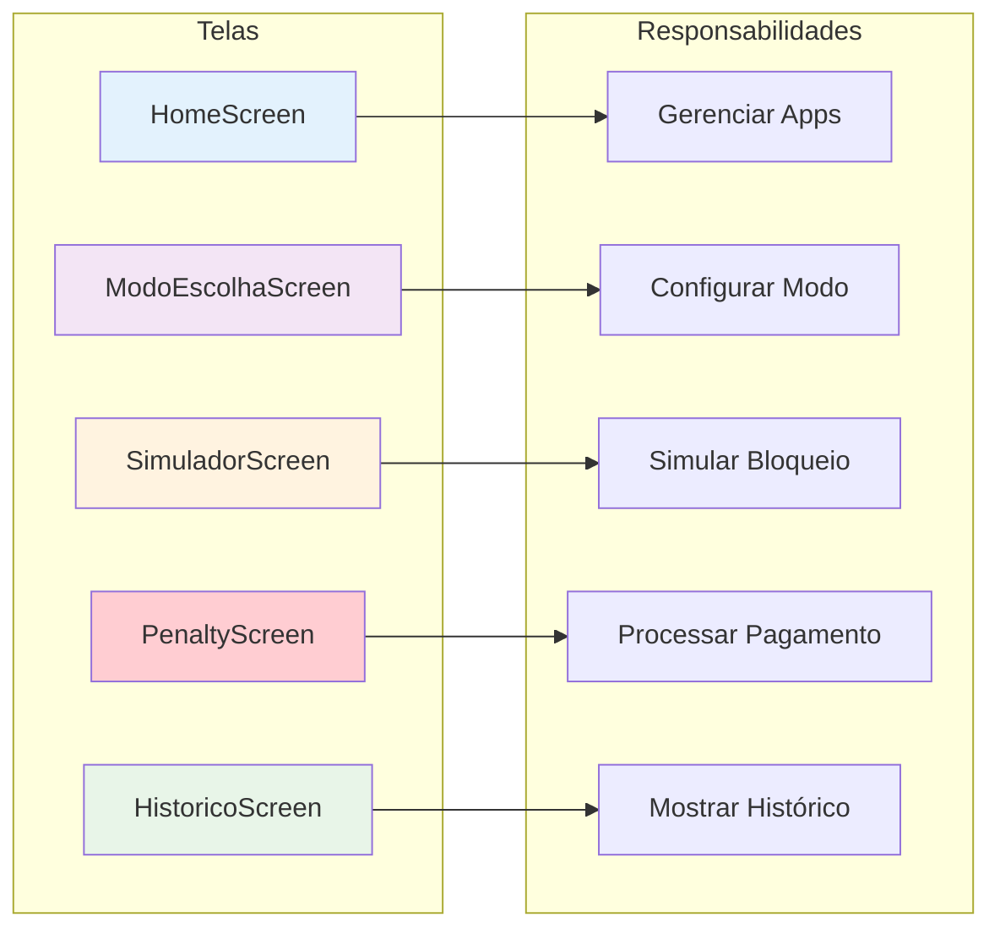
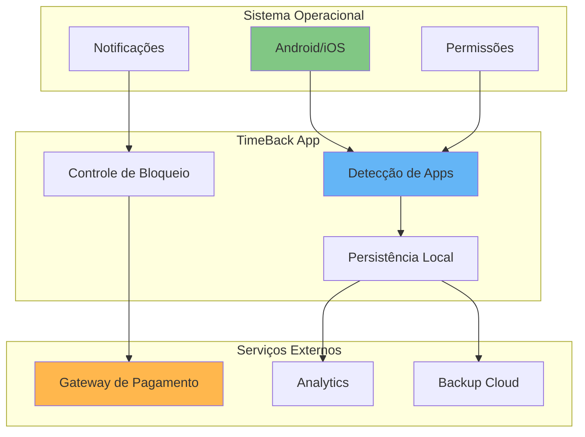

# Diagrama de Fluxo do Usuário - TimeBack App

## Fluxo Completo de Uso do Aplicativo

## Fluxo Detalhado de Decisões

## Estados do Aplicativo

## Matriz de Responsabilidades

## Pontos de Integração

