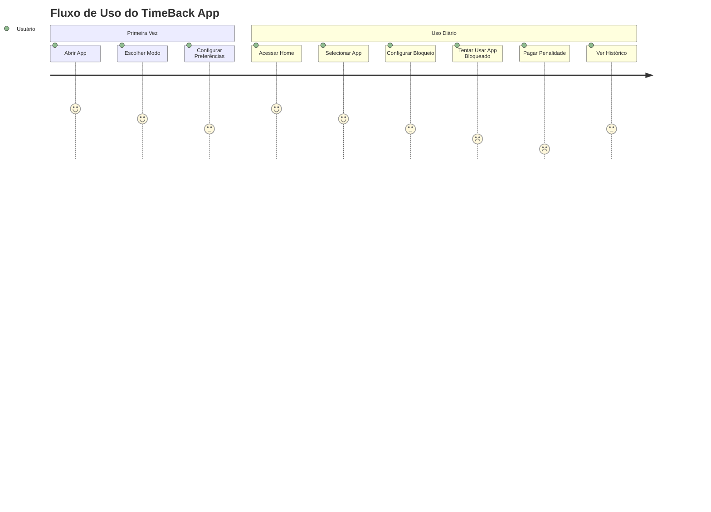
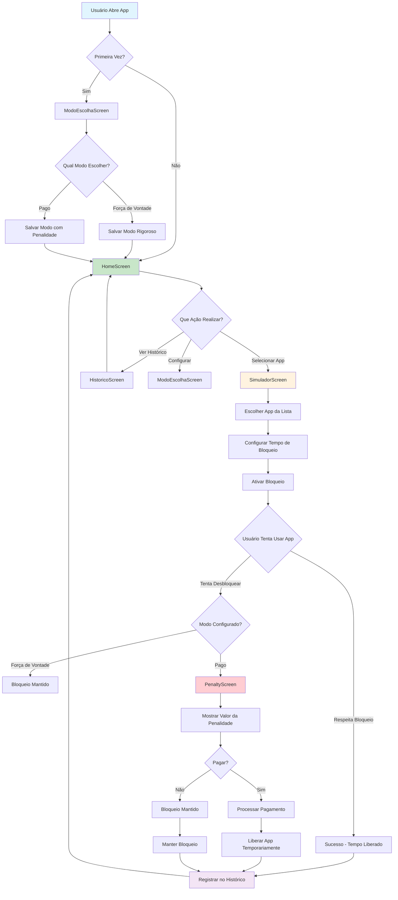
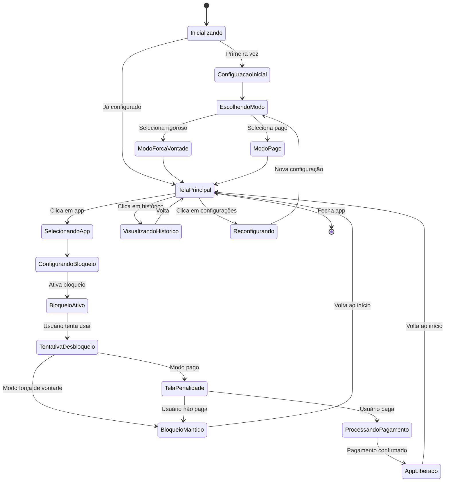
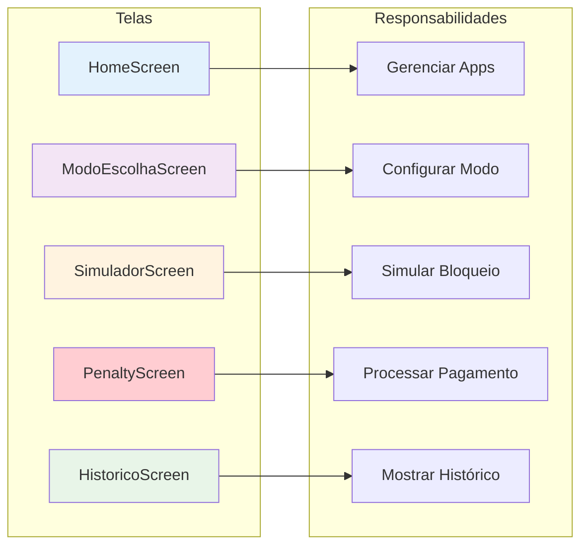
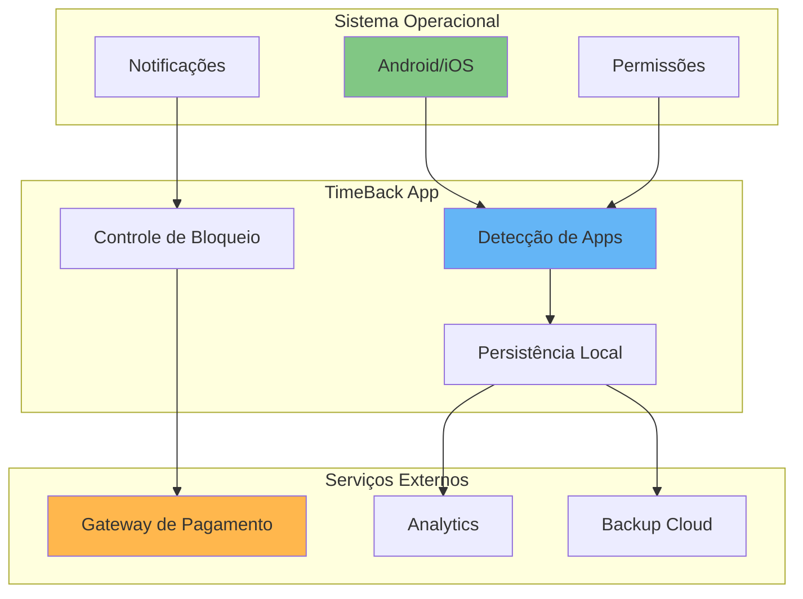
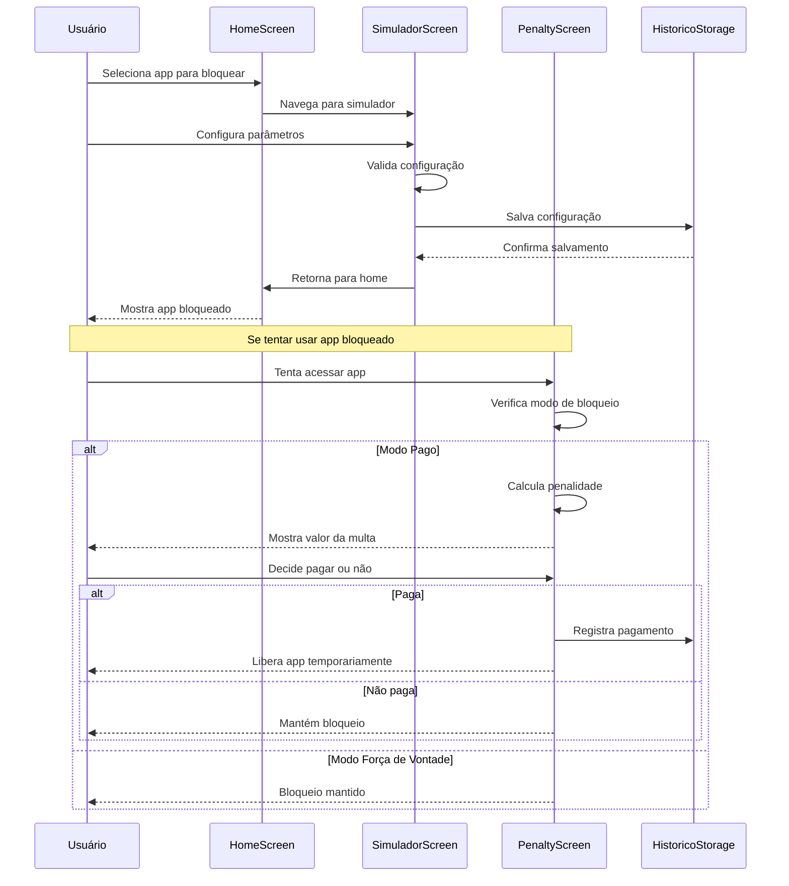
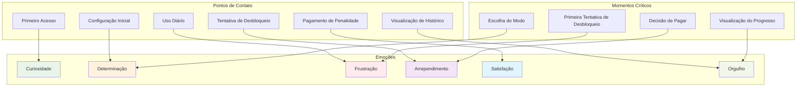
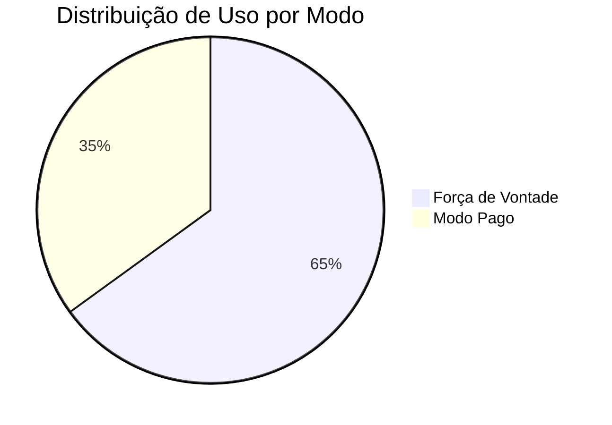
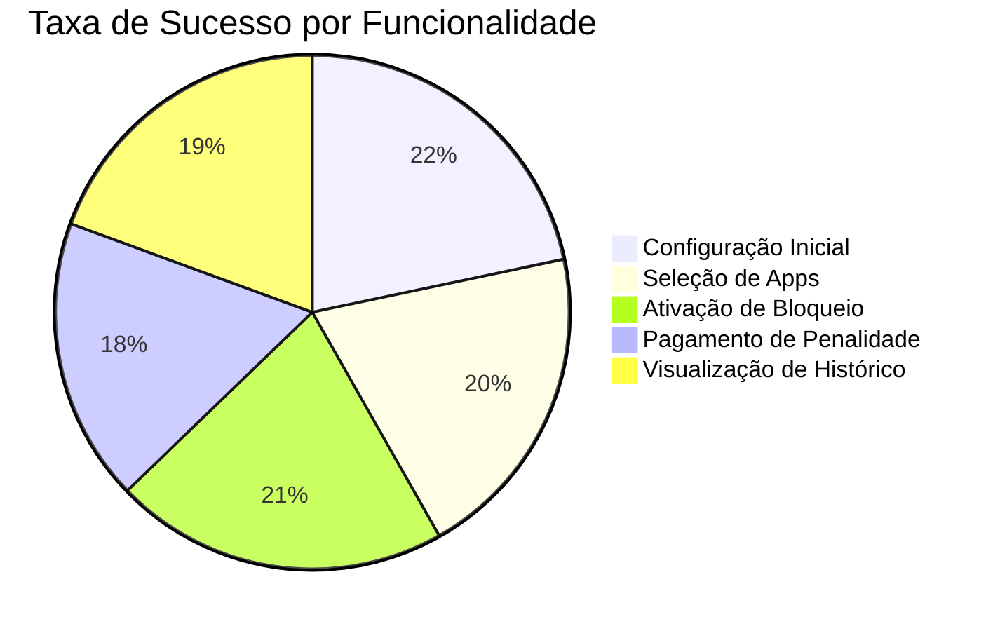
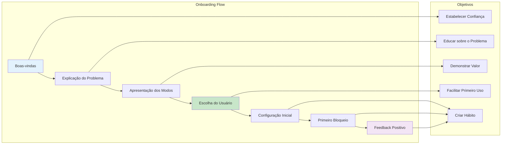

# Diagrama de Fluxo do Usuário - TimeBack App

## Fluxo Completo de Uso do Aplicativo

## Fluxo Detalhado de Decisões

## Estados do Aplicativo

## Matriz de Responsabilidades

## Pontos de Integração

## Fluxo de Configuração de Bloqueio

## Análise de Experiência do Usuário

## Métricas de Engajamento

## Fluxo de Onboarding

## Resumo dos Fluxos

### **Principais Jornadas do Usuário:**

1. **Configuração Inicial**
   - Primeiro acesso → Escolha de modo → Configuração → Primeiro uso

2. **Uso Diário**
   - Acesso → Seleção de apps → Configuração de bloqueios → Monitoramento

3. **Tentativa de Desbloqueio**
   - Tentativa → Verificação de modo → Ação (bloqueio/pagamento) → Resultado

4. **Análise de Progresso**
   - Acesso ao histórico → Visualização de dados → Reflexão → Ajustes

### **Pontos de Atenção:**

- **Momento de Escolha**: Decisão entre modos é crítica
- **Primeira Tentativa**: Define expectativas do usuário
- **Pagamento**: Pode gerar arrependimento ou satisfação
- **Histórico**: Motiva continuidade do uso

### **Otimizações Identificadas:**

- Simplificar configuração inicial
- Melhorar feedback visual
- Adicionar gamificação
- Personalizar experiência por perfil
