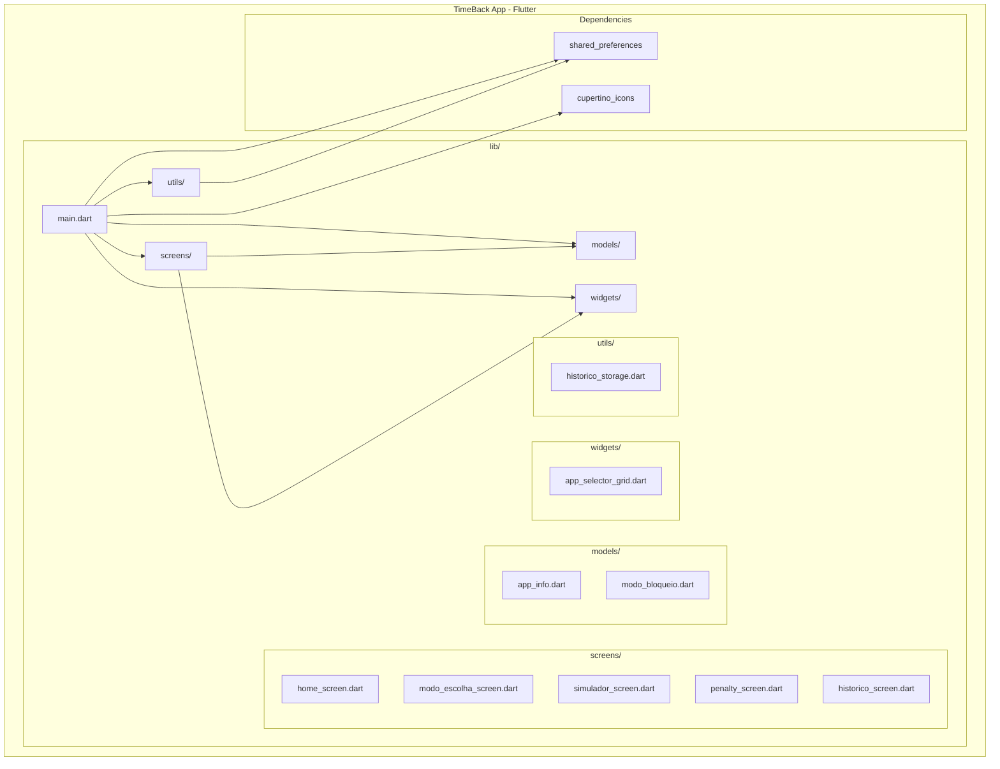
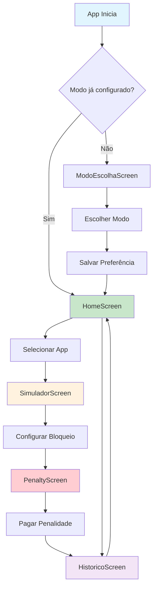
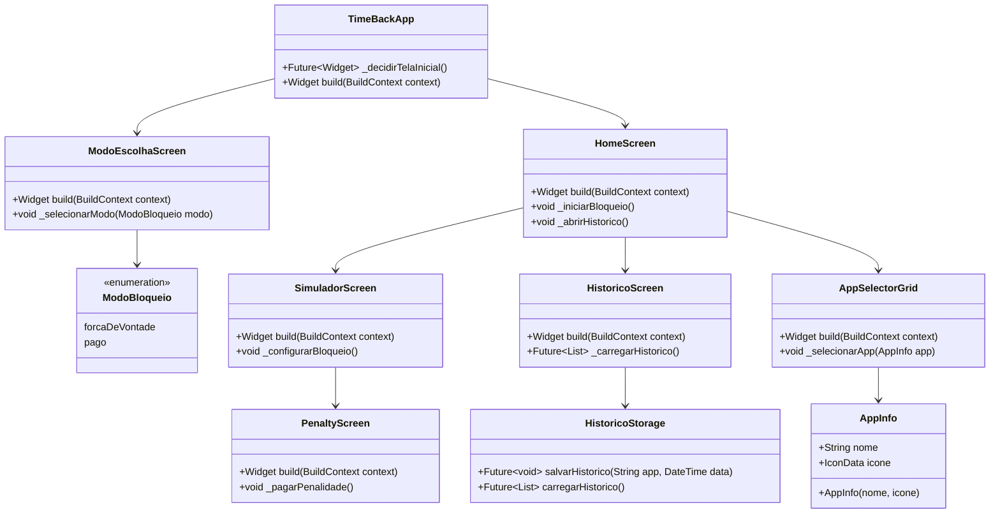
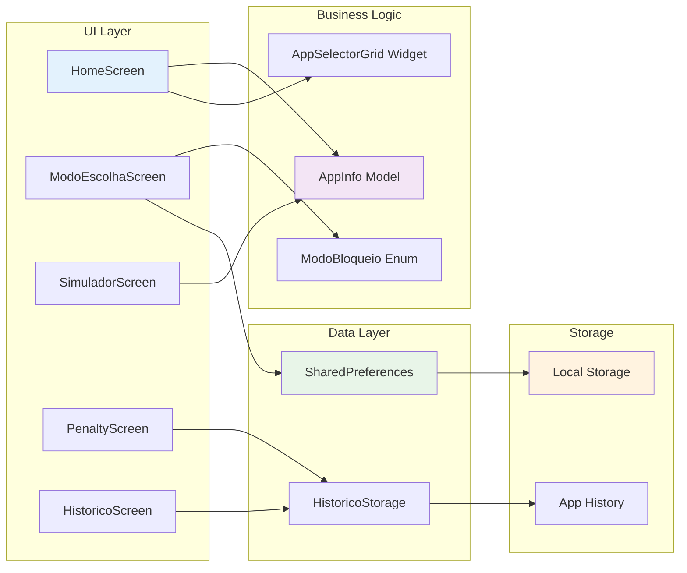
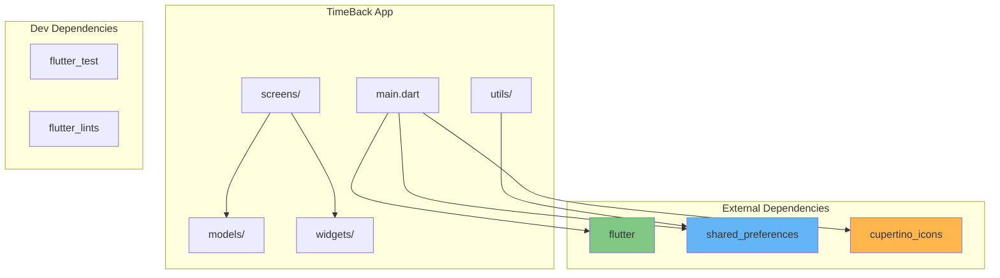
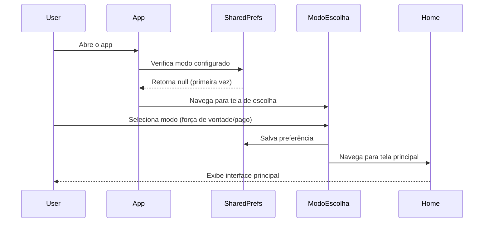

# Diagramas do Projeto TimeBack App

## 1. Arquitetura Geral do Projeto

## 2. Fluxo de Navegação entre Telas

## 3. Diagrama de Classes/Modelos

## 4. Fluxo de Dados e Persistência

## 5. Estrutura de Dependências

## 6. Fluxo de Configuração Inicial

## Resumo da Arquitetura

O **TimeBack App** é um aplicativo Flutter que implementa um sistema de controle de tempo para aplicativos móveis. A arquitetura segue o padrão MVC (Model-View-Controller) com as seguintes características:

### **Camadas:**
- **UI Layer**: Telas e widgets responsáveis pela interface
- **Business Logic**: Modelos e lógica de negócio
- **Data Layer**: Utilitários para persistência de dados
- **Storage**: Armazenamento local usando SharedPreferences

### **Funcionalidades Principais:**
1. **Seleção de Modo**: Escolha entre bloqueio por força de vontade ou pago
2. **Seleção de Apps**: Grid para escolher aplicativos para bloquear
3. **Simulação de Bloqueio**: Interface para configurar bloqueios
4. **Sistema de Penalidades**: Tela para pagar multas por uso
5. **Histórico**: Registro de atividades e bloqueios

### **Tecnologias:**
- **Framework**: Flutter/Dart
- **Persistência**: SharedPreferences
- **UI**: Material Design 3
- **Plataformas**: Android, iOS, Web, Desktop
